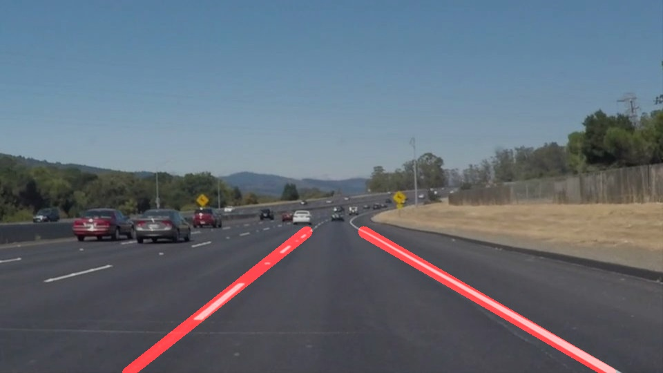
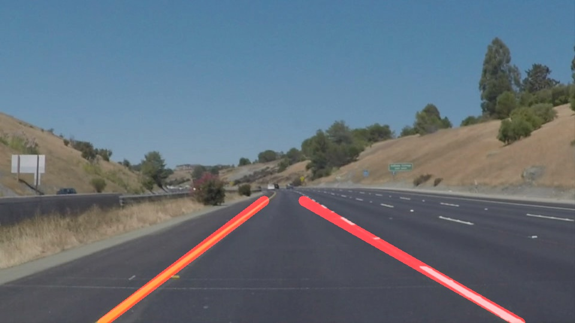

# **Finding Lane Lines on the Road**

Project repository: https://github.com/nutmas/CarND-LaneLines-P1.git

---

**Project Goals and Objectives**

The goal of this project was to develop a pipeline that implements a number of functions to generate a drivable area ahead of the vehicle by detection of the painted lines on a road.

---

### Reflection

###

The functions utilised in this pipeline were:

* Convert image to grayscale - _to ease image manipulations_
* Apply Gaussian blur to the image - _to smooth the edges in the image_
* Utilise Canny edge detection algorithm - _detect edges present in the image based on threshold set values_
* Create a area of interest using a mask - _specify a static polygon in the image to set boundaries of area to process_
* Combine the canny edge output and the mask to limit the area of interest - _trim the image and edge output to a smaller area avoid processing unnecessary areas of the image_
* Run Hough transform - _detection of lines in the area of interest_
* Draw lines using the Hough transform output - _separate lines into 2 groups and create 2 lines to represent lanes_

The majority of the functions involved tuning the parameters to try to optimise the results. This process was trial and error for each function and improving one function didn't necessarily result in an overall improvement in the output result. The values used were based on best practice advice.

**An area of development was the draw_lines() function:**

The Hough lines function would work through the image to determine where the lines in the image exist. It takes the edges detected and outputs it as a line. This produced a number of lines to represent the left and right lane markings.
In order to further process this output the left and right detections needed to be separated into left side or right side:

* Create 2 arrays to hold the left and right lane lines.
* Utilise line equation to calculate gradient of line.
* Append to relative array - positive gradient = right / negative gradient = left (if gradient was 0 then ignore as is vertical and could skew result)
* Find mean of left and right list of lines.
* Set the co-ordinates for each point of line:
    - y positions are set as height of image, and mask upper edge position
    - x positions are calculated using line equation and results from mean values
* Left and right lines are drawn from these coordinates; the line is thickened and coloured red to make it visible.
* Finally the output is overlaid onto the original image with transparency and the result is two red lines drawn to indicate the lane marking detection.

This pipeline was applied to a selection of images.
In the notebook each stage for each image is shown with the resulting overlaid lines. An example output is included below:

### 2. Shortcomings that can be identified with this pipeline

The pipeline was applied to a video file; With white lines only the output could be seen to track the lines for the whole video with one glitch where the left line jumped; With further tuning and filtering this could be improved.

In order to meet the challenge of yellow lines the pipeline had to be modified.
I created a new function called colour_masking().

* Convert image to HSV(hue, saturation and value) channels as opposed to RGB
* Set image threshold values for yellow and create mask for yellow line
* Set image threshold values for white and create mask for white line
* Combine both masks into one using a bitwise OR - function can identify both lines in image

This function was added into the pipeline to replace the gaussian blur and canny edge detection.

A sample of this applied is shown:

When ran with the video the pipeline can detect the lines, but the on a number of occurrence the lines start to jump around the video.

### 3. Improvements that could be made to the pipeline:

The  method for setting thresholds and parameters is to start from a best default and then trial and error to try to improve on the outcomes. This method can produce a good result for one or two test images, but when applied to a new image; such as yellow lines the pipeline falls over.
_utilising some algorithm that could learn the range of values possible modify itself to detect the lane lines based on changes in light would improve the detection and keep a more consistent result_

The mask that is created is a fixed polygon set for one horizon point. This fixes the highest detection point in the image which can produce 2 shortcomings:
* When the road bends and the mask is over that region then the line detection cannot cover this outcome and starts to jump around.
* When the road horizon rises - such as going downhill; the detection area is limited to the fixed point of the mask, which results in the range of vision being reduced.
_having a dynamic mask that would move with the vehicle tilt angle would allow the area of interest to be more consistent_
_The line detection algorithm would require improving to take into consideration lines bending and not simply being two linear projections from the vehicle._
